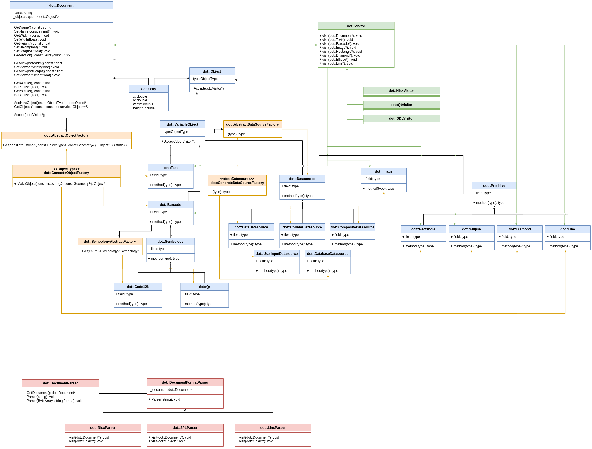

# DOT Message

Repositorio con la estructura del arbol de objectos (DOM) para la generación de etiquetas DOT.

## Version actual 

[![version][version]][release]

[version]:https://img.shields.io/badge/DotMessage-v1.0.3-green?style=flat
[release]:https://github.com/ascam/DotMessage/releases/tag/v1.0.3

### :bookmark: Dependencias:

- [![DotSystem v0.2.0][dotsystem_020]](https://github.com/ascam/DOTSystem/releases/tag/v0.2.0)
- [![MacsaUtils v4.1.1][macsautils_411]](https://github.com/ascam/utils/releases/tag/v4.1.1)

[//]: # "Dependencies badgets"
[dotsystem_020]:https://img.shields.io/badge/DotSystem-v0.2.0-blue?style=flat
[macsautils_411]:https://img.shields.io/badge/MacsaUtils-v4.1.1-blue?style=flat

## Diagrama UML

